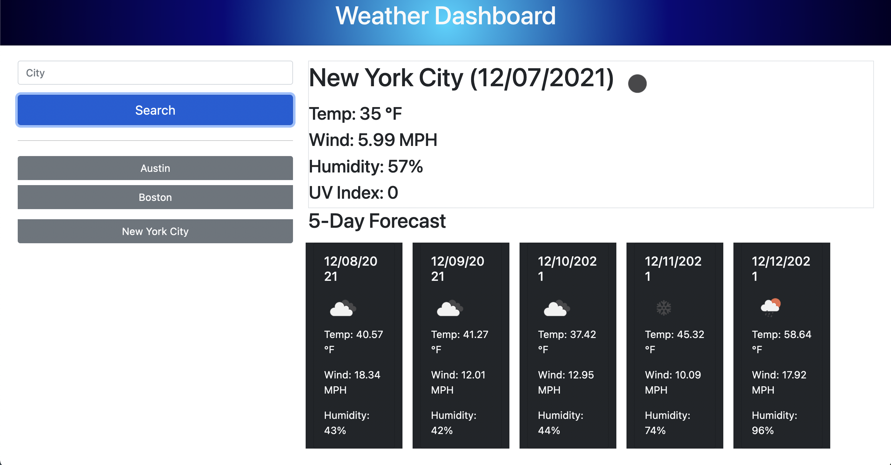

# **Weather Dashboard**

## **Resources**
-View repository [here.](https://github.com/charlottehulseman/weather-dashboard)

-View GitHub Pages website [here.](https://charlottehulseman.github.io/weather-dashboard/)

## **Description**
Weather dashboard that displays the current weather and weekly forecast of any searched city. Search history is recorded and can be easily navigated to. This dashboard uses the Open Weather Map API. 

## **Usage Instructions**
Navigate to the GitHub pages link to view the published website.

## **Installation Instructions**
Installation is not required. Clone the repository to your local system, and open `index.html` in your default browser to view the website locally.

## **Contact**
Developer GitHub: https://github.com/charlottehulseman
Or contact me via email with any questions at cchulseman@gmail.com